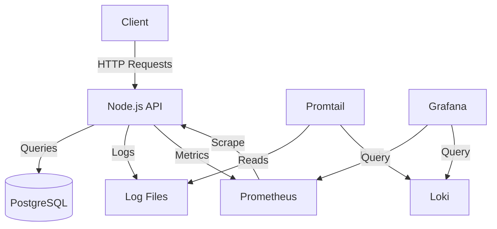

# Backend API Service

A modern Node.js API with a complete monitoring and logging stack.

## Features

- **Node.js & Express**: Fast and scalable web server.
- **PostgreSQL & Prisma**: Robust database and ORM.
- **Monitoring**: Prometheus (Metrics) & Grafana (Visualization).
- **Logging**: Winston (Application Logs) & Loki/Promtail (Log Aggregation).
- **Security**: Helmet, CORS, Rate Limiting.

## Architecture

The project follows a microservices-ready architecture using Docker containers.



### Directory Structure

```
├── config/         # Configuration files (Database, Logger)
├── controllers/    # Request handlers
├── middleware/     # Express middlewares (Auth, Validation)
├── prisma/         # Database schema and migrations
├── routes/         # API Route definitions
├── utils/          # Utility functions
├── logs/           # Application logs (Shared volume)
└── docker-compose.yml # Stack orchestration
```

## Getting Started

### Prerequisites

- Docker & Docker Compose
- Node.js (for local development)

### Running with Docker (Recommended)

Start the entire stack (App, DB, Monitoring):

```bash
docker compose up --build -d
```

### Accessing Services

| Service        | URL                                                            | Credentials       |
| -------------- | -------------------------------------------------------------- | ----------------- |
| **API**        | [http://localhost:5000](http://localhost:5000)                 | -                 |
| **Metrics**    | [http://localhost:5000/metrics](http://localhost:5000/metrics) | -                 |
| **Grafana**    | [http://localhost:3000](http://localhost:3000)                 | `admin` / `admin` |
| **Prometheus** | [http://localhost:9090](http://localhost:9090)                 | -                 |

## Monitoring & Logging Setup

### 1. Configure Grafana

1.  Log in to Grafana.
2.  **Add Prometheus Data Source**:
    - URL: `http://prometheus:9090`
3.  **Add Loki Data Source**:
    - URL: `http://loki:3100`

### 2. Visualize Metrics

- Import Dashboard ID `11159` (Node.js Exporter) or create custom panels.
- Query metrics like `process_cpu_seconds_total` or `http_request_duration_seconds`.

### 3. Parse Logs

- Go to **Explore** sidebar item.
- Select **Loki** as source.
- Query logs with: `{job="backend-logs"}`.

## Development

Install dependencies:

```bash
npm install
```

Start in dev mode:

```bash
npm run dev
```

## API Endpoints

- `GET /`: API Health & Info
- `GET /health`: Health Check
- `POST /api/v1/auth/register`: Register User
- `POST /api/v1/auth/login`: Login User
- `GET /api/v1/movies`: List Movies
